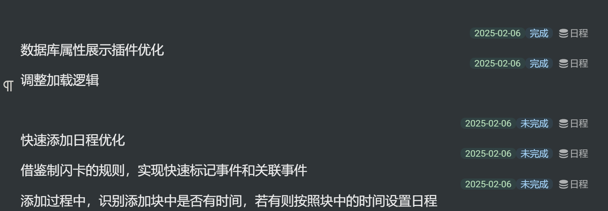

# SiYuan Database Display Plugin

Display database attribute values of blocks, supporting 99% of blocks!



## ✨ Features

### 📊 Database Field Display
- **Comprehensive Support**: Supports 99% of block types for database attribute display
- **Multi-field Types**: Supports multiple select, number, date, text, asset, checkbox, phone, URL, email and other field types
- **Smart Filtering**: Automatically filters empty values, null and undefined

### 🎛️ Field Display Control
- **Custom Display Fields**: Configure which field types to display for document blocks and regular blocks separately
- **Field Hiding**: Support hiding sensitive or unnecessary fields (such as passwords, private information, etc.)
- **Real-time Configuration**: Settings take effect immediately after modification, no restart required

### 📅 Date Time Formatting
- **Multiple Date Formats**:
  - `YYYY-MM-DD`: 2023-12-25
  - `YYYY/MM/DD`: 2023/12/25
  - `MM/DD/YYYY`: 12/25/2023
  - `DD/MM/YYYY`: 25/12/2023
  - **Full Format**: Monday, December 25, 2023
  - **Relative Time**: 3 days ago, tomorrow, today
- **Time Display Control**: Option to show or hide specific time (hour:minute:second)
- **Smart Timestamp Recognition**: Automatically handles second-level and millisecond-level timestamps

### ☑️ Checkbox Beautified Display
- **Emoji Style**: ✅ / ❌ (default, intuitive and easy to understand)
- **Symbol Style**: ☑ / ☐ (simple and professional)
- **Text Description**: Selected / Unselected (clear and explicit)

### 🎨 Interface Beautification
- **Responsive Layout**: Adapts to different screen sizes
- **Modern Design**: Clean and beautiful user interface

## ⚙️ Settings Options

### Field Display Settings
- **Document Block Display Fields**: Set field types to display for document blocks
- **Regular Block Display Fields**: Set field types to display for regular blocks
- **Hidden Field Names**: Set specific field names to hide (comma-separated)

### Display Format Settings
- **Date Display Format**: Choose the display format for date fields
- **Show Time**: Control whether to include specific time in dates
- **Checkbox Display Style**: Choose the display style for checkboxes

## 🚀 Usage

1. **Install Plugin**: Download and install from SiYuan plugin marketplace
2. **Basic Usage**: The plugin automatically displays database attributes of blocks
3. **Custom Settings**:
   - Open plugin settings page
   - Configure display fields and formats as needed
   - Set fields to hide
   - Choose preferred date and checkbox display styles

## 📝 Configuration Examples

### Hide Sensitive Fields
```
password,private_info,internal_notes,confidential
```

### Custom Display Fields
```
mSelect,text,date,checkbox
```

## 🛠️ Technical Features

- **TypeScript**: Full type safety support
- **Modular Design**: Clear code structure and component separation
- **Error Handling**: Graceful error handling and user feedback
- **Performance Optimization**: Efficient data processing and DOM operations
- **Extensibility**: Easy to add new field types and display styles

## 📋 Changelog

### Latest Version
- ✅ Added field hiding functionality
- ✅ Optimized date time display, fixed time offset issues
- ✅ Added multiple date format support
- ✅ Beautified checkbox display effects
- ✅ Enhanced settings page configuration options
- ✅ Improved error handling and user feedback

### Completed Features
- ✅ Basic database attribute display functionality
- ✅ Support for 99% of block types
- ✅ Beautified display interface
- ✅ Field type filtering
- ✅ Real-time configuration updates
- ✅ Multiple display format support

## 🐛 Issue Reporting

If you find any issues or have feature suggestions, please:
1. Submit detailed problem descriptions and reproduction steps
2. Or provide feedback in the SiYuan community

## 🙏 Acknowledgments

- Thanks to [A-chuan](https://ld246.com/member/Achuan-2) for the design inspiration from the [tsundoku](https://github.com/Achuan-2/siyuan-themes-tsundoku) theme
- Thanks to the SiYuan community for support
