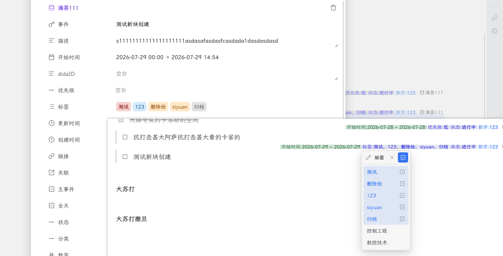

# 思源数据库属性展示

让块的数据库属性信息，一目了然。

支持 **99% 的块**，并提供灵活的字段筛选与显示设置。

  
  
  

## 📖 详细介绍

查看插件的图文介绍：[插件图文介绍](https://p.kdocs.cn/s/ZSSC56BIABQGU)

## 🖼️ 效果预览

  

## 🔓 开源与 Pro

插件的核心展示能力及现有显示设置保持开源。项目通过云端 GitHub Actions 构建，构建过程透明，降低恶意代码注入风险。

Pro 为一次性买断制，仅绑定思源用户 ID，不绑定设备，也不设使用期限；同一思源账号可在所有设备上使用。

> Pro 功能用于支持项目的持续开发。核心展示功能不受影响，欢迎通过源码参与改进。

## 💬 问题反馈

如果你遇到问题或有功能建议，欢迎：

- 在 [GitHub Issues](https://github.com/loonghfut/siyuan-database-display/issues) 提交详细的问题描述、运行环境和复现步骤；
- 在思源笔记社区中反馈使用体验。

## 🙏 致谢

感谢思源笔记社区提供的插件模板与帮助。

## ☕ 支持项目

如果这个插件对你有帮助，欢迎请作者喝杯咖啡，支持项目持续维护：

  

